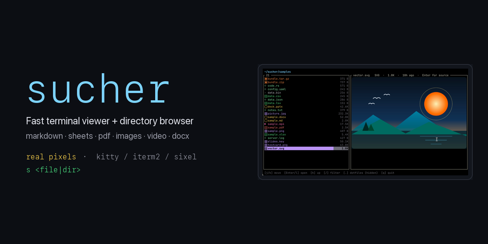
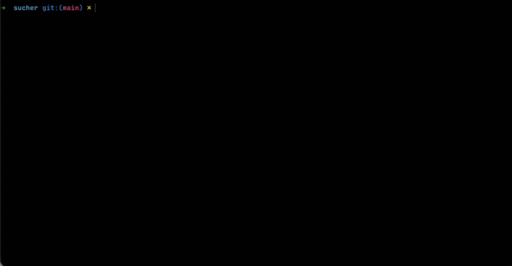
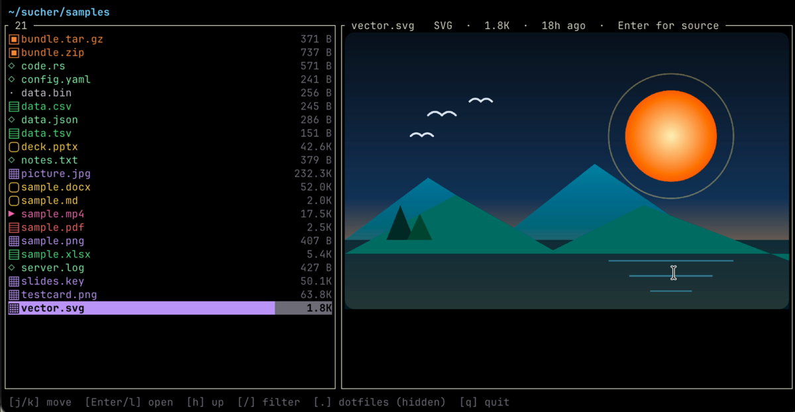
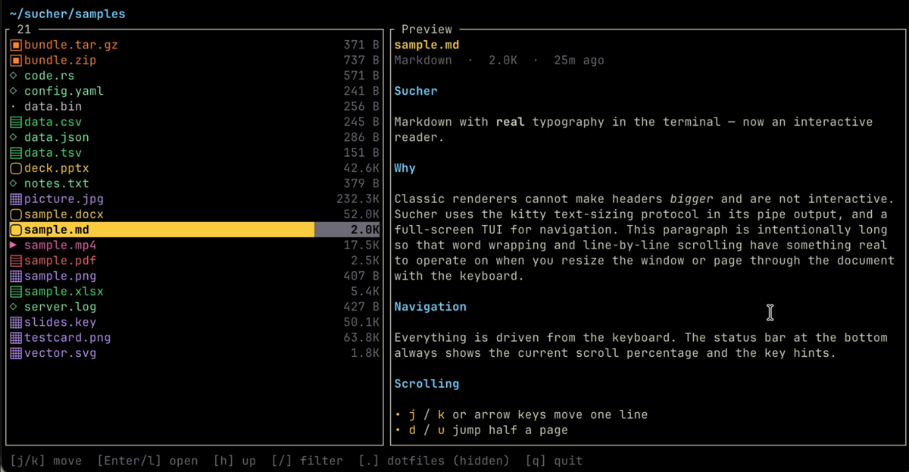
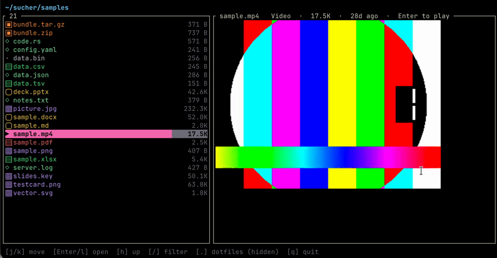

<p align="center">
  
</p>

# sucher

[](https://github.com/john-athan/sucher/actions/workflows/ci.yml)
[](LICENSE)
[](https://www.rust-lang.org)
[](https://ratatui.rs)

A fast terminal viewer for the files that are awkward to open in a browser —
**markdown, spreadsheets, PDF, images, SVG, video, Word/PowerPoint/Keynote,
archives, and raw binary** — behind one tiny command:

```sh
s report.md
s data.xlsx
s paper.pdf
s photo.jpg
s diagram.svg
s clip.mp4
s deck.pptx
s archive.zip
s ~/projects        # or a directory — browse and open files in place
s                   # no argument: browse the current directory
```

*Sucher* is German for the camera **viewfinder** — the little window you look
through to frame a shot. This one frames files: it picks a viewer by file
extension and renders it in place, using your terminal's graphics protocol for
real pixels where one is available.

## Demo

<!-- Capture in a graphics terminal, then commit assets/. See assets/README.md. -->


| Directory browser | Markdown & docs | Video & images |
| :---: | :---: | :---: |
|  |  |  |

---

## Highlights

- **One launcher, many formats** — dispatch by extension, sensible TUI per type.
- **Directory browser** — point `s` at a folder (or run it bare) for a fast,
  two-pane navigator: live preview pane, fuzzy filter, and `Enter` opens the
  selection in its viewer, then drops you back where you were.
- **Recursive search** (`S`) — find files anywhere below the current directory,
  streamed live as they're found (ripgrep's own walker, `.gitignore`-aware). The
  same smart query as the filter, plus `content:` to grep *inside* files — and
  every hit renders in the preview pane as the **actual framed file** (the PDF
  page, the image, the spreadsheet grid), not a grey line of text.
- **Handles huge files** — a 240 MB / 800k-row spreadsheet opens in ~160 ms and
  stays scrollable, because sheets stream in on a background thread instead of
  being loaded whole.
- **Real graphics** — images, rasterised SVGs, PDF pages, video frames, and
  Keynote previews render as actual pixels via the kitty / iTerm2 / sixel
  protocols (with a Unicode half-block fallback), through
  [`ratatui-image`](https://crates.io/crates/ratatui-image).
- **Real typography in pipe mode** — `s --plain doc.md` emits the kitty
  text-sizing protocol so headings render *larger* on supporting terminals;
  detected at runtime, with graceful fallback.
- **Responsive** — event-driven redraw (no idle CPU churn) and background work
  for the expensive bits.

## Supported formats

| Category | Extensions | Backend |
|----------|-----------|---------|
| Markdown | `.md` `.markdown` `.mdx` | [`pulldown-cmark`](https://crates.io/crates/pulldown-cmark) |
| HTML | `.html` `.htm` `.xhtml` | [`html5ever`](https://crates.io/crates/html5ever) DOM walk → markdown renderer |
| Text / source | code, `.txt` `.log`, config files, extension-less UTF-8 text | syntax-highlighted text viewer (no soft-wrap; pan + search) |
| Spreadsheet | `.xlsx`, `.xlsm` | streaming reader (zip + quick-xml) on a worker thread |
| Spreadsheet | `.xls`, `.ods`, `.xlsb`, `.csv`, `.tsv` | [`calamine`](https://crates.io/crates/calamine) (eager); csv/tsv parsed into the grid |
| PDF | `.pdf` | poppler `pdftocairo` → graphics |
| Image | `.png` `.jpg` `.jpeg` `.gif` `.webp` `.bmp` `.tiff` `.ico` | [`image`](https://crates.io/crates/image) → graphics |
| SVG | `.svg` | [`resvg`](https://crates.io/crates/resvg) rasteriser → picture above scrolling source |
| Video | `.mp4` `.mov` `.mkv` `.webm` `.avi` `.m4v` | streaming `ffmpeg` pipe → graphics |
| Word | `.docx` | unzip + streaming XML → markdown renderer |
| Presentation | `.pptx` | unzip + streaming XML (slide text) → markdown renderer |
| Keynote | `.key` | embedded QuickLook preview image → graphics |
| Archive | `.zip` `.tar` `.tar.gz` `.tgz` `.gz` | navigable table of contents (folders + path + size); no extraction |
| Binary | unrecognized non-text files | scrolling canonical hexdump (`offset │ hex │ ASCII`) |
| Directory | any folder | two-pane file browser (list + live preview) |

Comma/tab-separated values (`.csv` `.tsv`) open in the spreadsheet grid.
Legacy office binaries (`.doc` `.rtf` `.odt` `.ppt`) and audio have no viewer:
opening one shows a one-line size/modified summary rather than launching a viewer
or dumping bytes. Other archive types (`.7z` `.rar` `.xz` `.bz2` `.zst`) are
recognized but have no lister; extract them with a shell tool.

When stdout is not a TTY (piped), sucher prints a sensible text dump instead of
launching the TUI (`pdftotext` for PDF, TSV for sheets, metadata for video,
styled text for markdown/html/docx/pptx, faithful bytes for text/source, raw XML for
SVG, a canonical hexdump for binary, a `size⇥path` table for archives, a plain
listing for directories).

## Install

Requires a recent **Rust** toolchain.

```sh
# Quickest — installs the `sucher` binary into ~/.cargo/bin:
cargo install --git https://github.com/john-athan/sucher
```

Or clone for the short `s` alias and `make` targets:

```sh
git clone https://github.com/john-athan/sucher
cd sucher
make install        # builds --release, installs `sucher`, symlinks `s`
```

`make install` puts the binary in `~/.cargo/bin` and creates a short `s`
symlink next to it. (`make uninstall` removes both.)

### Optional runtime dependencies

These are only needed for the formats that shell out to them:

| For | Needs | macOS |
|-----|-------|-------|
| PDF | poppler (`pdftocairo`, `pdfinfo`, `pdftotext`) | `brew install poppler` |
| Video | `ffmpeg`, `ffprobe` | `brew install ffmpeg` |

For pixel-perfect images / PDF / video, use a terminal with a graphics
protocol — **kitty, ghostty, WezTerm, iTerm2**, or any sixel-capable terminal.
Without one, sucher falls back to Unicode half-blocks.

## Themes, icons & layout

The browser's palette, file icons, column layout, and git gutter are
configurable. Resolution order, highest first:
**CLI flag → environment variable → config file → default.**

```sh
s --theme catppuccin-mocha --icons nerd ~/projects
SUCHER_THEME=gruvbox-dark SUCHER_ICONS=none s
s --layout miller ~/projects        # force three columns
s --no-git .                        # hide the git gutter
```

Config file at `$XDG_CONFIG_HOME/sucher/config.toml` (else
`~/.config/sucher/config.toml`); a missing or malformed file is ignored, never
fatal:

```toml
theme  = "catppuccin-mocha"  # or "auto" | built-in name (default: sucher-dark)
icons  = "nerd"              # "unicode" (default) | "nerd" | "none"
layout = "auto"              # "auto" (default) | "miller" | "double"
git    = true                # show the git status gutter (default: true)
mouse  = true                # click rows/breadcrumb, wheel-scroll (default: true)
animate = true               # folder fade + full-view zoom (default: true)

[colors]                     # optional per-key hex overrides, applied last
accent = "#7dd3fc"
selection = "#26324a"
```

- **Themes** — built-ins: `sucher-dark` (the default), `sucher-light`,
  `catppuccin-mocha`, `gruvbox-dark`, `tokyo-night`. `theme = "auto"` picks a
  light or dark default from the terminal background (`COLORFGBG` / OSC 11,
  falling back to dark).
- **Icons** — `unicode` (geometric glyphs, renders on any font — the default),
  `nerd` (per-extension [Nerd Font](https://www.nerdfonts.com/) glyphs with
  per-language tints — **requires a patched Nerd Font**; not auto-detected, so
  opt in), or `none` (no icon column).
- **Layout** — `auto` shows three columns (**parent · current · preview**, the
  ranger-style [Miller layout](https://en.wikipedia.org/wiki/Miller_columns)) on
  wide terminals (≥ 100 cols) and collapses to two (**current · preview**) when
  narrow; `miller` forces three, `double` forces two. Toggle live with `M`.
- **Git gutter** — in a git working tree, each entry shows a colored status
  marker (`●` modified · `+` added · `?` untracked · `✗` deleted · `»` renamed ·
  `!` conflict); directories aggregate their descendants' changes. Absent
  outside a repo or with `git = false`.
- **Mouse** — click a file row to select it, click the highlighted row to open
  it (or enter a folder); click a breadcrumb segment to jump there; in the
  three-column layout click the left pane to go up; scroll the wheel to move the
  selection. Capturing the mouse disables the terminal's own click-drag text
  selection inside sucher (Shift/Option-drag still bypasses it in most
  terminals); set `mouse = false` to keep native selection.
- **Animations** — entering/leaving a folder fades the new listing in; opening a
  file in the full-screen image viewer zooms it up (and back down on close). Both
  are time-based (~120–150 ms), interruptible by any keypress, and disabled with
  `animate = false`. The folder fade is a cheap cell redraw that presents at the
  display's refresh rate; the image zoom re-encodes the picture each frame, so it
  runs at whatever the graphics pipeline sustains (constant duration either way).
  `SUCHER_ANIM_STATS=1` prints each animation's achieved frame rate on exit.

## Usage & keys

```sh
s <file>            # interactive viewer (TTY)
s <dir>  /  s       # directory browser (bare `s` = current dir)
s --plain <file>    # one-shot styled dump to stdout
s <file> | less     # piped: text dump
```

**Directory** — `j`/`k` `↑`/`↓` move · `d`/`u` half-page · `g`/`G` top/bottom ·
`Enter`/`l`/`→` open file or enter folder · `h`/`←`/`Backspace` parent ·
`/` smart filter · `S` recursive search · `o` cycle sort (name/size/modified/ext) ·
`O` reverse sort · `.` toggle dotfiles · `M` two/three-column layout ·
`t` size/modified column · `?` key overlay · `q` quit. Press `?` for a
which-key overlay of every binding (it also shows the current sort). Click a
breadcrumb segment to jump there;
the wheel scrolls the list. The right pane renders a live
preview of the selection: **images (animated GIFs loop in place), SVGs, PDFs
(page 1), video posters, and Keynote previews as real pixels**,
**markdown/docx/pptx with full typography**, a
**grid preview for spreadsheets** (including csv/tsv), a **table of contents for
archives**, a **hexdump for binary**, a child listing for folders, and the head
of the file for text/code. Previews are cached as you move.

The `/` filter mixes free-text fuzzy matching with structured predicates, e.g.
`report kind:pdf size:>1mb modified:<7d ext:rs`. Plain words fuzzy-match the
name; four `key:value` predicates narrow by metadata:

- `kind:` — `pdf`, `image`, `video`, `audio`, `sheet`, `doc`, `markdown`,
  `code`, `archive`, `folder`, `binary` (and aliases).
- `ext:` — a file extension, e.g. `ext:rs`.
- `size:` — `>1mb`, `<=100kb`, `500` (units `b`/`kb`/`mb`/`gb`/`tb`; bare = at least).
- `modified:` — file age, e.g. `<7d`, `>2w` (units `s`/`m`/`h`/`d`/`w`/`mo`/`y`).

Outside the filter, just **type a name** to jump to the first matching entry
(type-to-select); a brief pause or `Esc` ends the jump, and the vim motion keys
keep working whenever you're not mid-type.

**Search** (`S`) is the filter's recursive sibling: instead of narrowing the
current listing, it walks the whole tree from here downward and **streams matches
in live** as they're found. Type to refine; `↑`/`↓` (and `PgUp`/`PgDn`) move
through results, `Enter` opens the selected hit (or jumps into it if it's a
folder), `Esc` returns to browsing. It takes the **same query language** as the
filter — every `kind:` / `ext:` / `size:` / `modified:` predicate works — plus
one more that only makes sense across files:

- `content:` (aliases `contains:` / `grep:`) — a literal substring to find
  *inside* files, e.g. `content:TODO ext:rs`. Matching is **smart-case**
  (case-insensitive unless you type an uppercase letter) and each hit shows the
  matching `line: text`. Powered by ripgrep's own line searcher, so binary files
  are skipped and huge files stream rather than load.

The walk uses ripgrep's parallel directory walker: it honours `.gitignore`, skips
dotfiles unless `.` toggled them on, and caps at 5000 hits (surfaced in the
status line). Because every result flows through the same preview pane, a hit is
shown as the **real rendered file** — the differentiator over `fd`/`rg`/`fzf`.

**Markdown** — `j`/`k` `↑`/`↓` scroll · `d`/`u` half-page · `g`/`G` top/bottom ·
`t` table of contents · `/` search (`n`/`N` next/prev) · `l` link picker ·
`i` image gallery (for docx/pptx embedded media; `n`/`p` cycle) · `?` help ·
`q` quit.

**Text / source** — `j`/`k` `↑`/`↓` scroll · `d`/`u` half-page · `g`/`G`
top/bottom · `h`/`l` pan long lines · `/` search (`n`/`N` next/prev) · `q` quit.

**Spreadsheet** — `h`/`j`/`k`/`l` or arrows move cell · `PgUp`/`PgDn` ·
`g`/`G` top/bottom · `Tab` / `[` `]` switch sheet · `/` search all cells
(`n`/`N` cycle) · `q` quit. Status bar shows the cell ref, value, and load
progress.

**PDF** — `j`/`k`, `←`/`→`, or `space` page · `g`/`G` first/last · `q` quit.
Visited pages are cached.

**Image** — `q` quit.

**SVG** — the rasterised picture fills the top pane; the XML source scrolls
below it with `j`/`k` `↑`/`↓` · `g`/`G` top/bottom · `q` quit.

**Video** — auto-plays on open · `space` play/pause · `←`/`→` ±5 s ·
`↑`/`↓` ±30 s · `,`/`.` frame step · `g`/`G` start/end · `q` quit. No audio.

**Archive** — `j`/`k` `↑`/`↓` move · `d`/`u` half-page · `g`/`G` top/bottom ·
`Enter`/`l` open folder · `h`/`Backspace` parent · `q` quit. A read-only,
navigable table of contents (path + size) with a breadcrumb; sucher lists and
lets you browse folders, but never extracts.

**Binary (hex)** — `j`/`k` `↑`/`↓` scroll · `d`/`u` page · `g`/`G` top/end ·
`q` quit.

## Remote filesystems (S3, GCS, …)

sucher is a **local** viewfinder: it works on any path the operating system
gives it. So the clean way to browse a cloud bucket is to make it *look* like a
path — mount it, then point `s` at the mount. No sucher-specific setup, no
credentials for sucher to hold, and everything works over it unchanged: the
browser, every viewer, and the recursive `S` search.

```sh
# Amazon S3 — AWS's official FUSE mount (or `rclone`, below)
mount-s3 my-bucket ~/mnt/s3          # https://github.com/awslabs/mountpoint-s3
s ~/mnt/s3

# Google Cloud Storage
gcsfuse my-bucket ~/mnt/gcs          # https://github.com/GoogleCloudPlatform/gcsfuse
s ~/mnt/gcs

# Anything rclone supports (S3, GCS, Azure, Backblaze, SFTP, …)
rclone mount remote:bucket ~/mnt/r --vfs-cache-mode full
s ~/mnt/r
```

Because the bytes come over the network, expect the obvious: previews and
graphics fetch on demand (a cache helps — e.g. rclone's `--vfs-cache-mode
full`), and a `content:` search downloads each candidate object, so scope it
with `ext:`/`size:` on large buckets. Name/`kind:`/`ext:`/`size:`/`modified:`
search only reads directory metadata and stays cheap.

Native cloud sourcing *inside* sucher (its own S3/GCS client, no mount) was
considered and deliberately left out for now — it would trade the zero-config
local-viewer identity for an SDK/auth/async surface, and mounts already cover
the use case. See [ADR 0007](docs/adr/0007-recursive-search.md) for the search
design that a native remote source would have to extend.

## How it works

```
main.rs        dispatch by format; TTY → TUI, pipe → text dump
format.rs      single classification registry (one source of truth)
dir.rs         directory browser (list + live preview), opens files via main
search.rs      recursive/streaming/content-aware search engine (ignore + grep)
markdown.rs    parse → logical lines + TOC + links; width-aware wrap/layout
tui.rs         markdown TUI (scroll / TOC / search / links)
text.rs        source/plain-text TUI (highlight, no wrap, pan + search)
plain.rs       one-shot markdown renderer (kitty text-sizing in pipe mode)
sheet.rs       grid UI over a `Book` (streaming xlsx, or eager calamine)
xlsx.rs        background streaming .xlsx reader (zip + quick-xml), capped
pdf.rs         poppler page raster + page cache, sized to the display
imgview.rs     image viewer
svg.rs         resvg rasteriser + split image/source viewer
video.rs       streaming ffmpeg pipe + background decoder, paced w/ frame-drop
html.rs        .html → markdown via html5ever DOM walk (reuses the renderer)
docx.rs        .docx → markdown (reuses the markdown renderer)
pptx.rs        .pptx slide text → markdown (reuses the markdown renderer)
keynote.rs     .key → embedded QuickLook preview image
archive.rs     zip/tar/gz table-of-contents lister
hex.rs         canonical hexdump viewer for binary files
media.rs       shared graphics pane (ratatui-image protocol probe + render)
```

Design notes:

- **One classifier.** `format.rs` owns a single `Format` registry that answers
  both *which viewer opens a file* and *how the browser colours / labels it*, so
  the two can never drift. Classification is a pure, unit-tested function
  (extension first; a byte head disambiguates only unknown / extension-less
  files). Only legacy office binaries (`.doc/.rtf/.odt/.ppt`) and audio lack a
  viewer: they show a one-line size/modified summary instead of opening, and
  their bytes are never fed to a text or markdown renderer.
- **Spreadsheets stream.** Only the current sheet is held in memory; rows are
  parsed incrementally on a worker thread and the grid reads them live, so
  opening is independent of total file size. Switching sheets frees the
  previous one. A row cap bounds pathological files.
- **PDF renders to display size** (`pdftocairo -scale-to-x <terminal px>`)
  rather than a fixed DPI, and caches rendered pages.
- **Video** drives a single long-lived `ffmpeg` process emitting raw frames; a
  decoder thread paces to real time and keeps only the latest frame, so a slow
  terminal drops frames instead of falling behind. Effective frame rate is
  bounded by how fast the terminal can transmit images, not by decoding.

## Development

```sh
make build      # cargo build --release
make run        # cargo run -- samples/sample.md
cargo test      # unit tests (markdown layout, docx conversion, xlsx search)
```

A large-workbook benchmark is included but ignored by default:

```sh
SUCHER_BIG=/path/to/big.xlsx cargo test --release big_xlsx -- --ignored --nocapture
```

## Limitations

- DOCX/PPTX keep text structure (headings, bold/italic, lists, tables; slide
  text as bullets). Embedded images are viewable in an image gallery (`i`) but
  not shown inline; page layout and exact styling are dropped.
- Keynote shows the embedded QuickLook preview (cover / first slide), not
  per-slide content — the IWA protobuf body isn't decoded.
- SVG rasterises shapes, gradients, and paths; `<text>` needs system fonts,
  which the headless rasteriser doesn't load, so text elements may not appear.
- Archives are listed and folder-navigable, but never extracted: you can browse
  into directories, though individual entries can't be opened or unpacked.
- Spreadsheet dates show as serial numbers (style table isn't read); the
  streaming reader caps very large sheets.
- Video has no audio, and terminal frame rate is capped by image transmission.
- Inside the full-screen TUI, markdown headings use color/bold (not the
  text-sizing protocol — that applies to `--plain` / pipe output).
- In the directory browser, previews render synchronously as you move the
  selection, so a PDF or video poster adds a brief raster pause on first visit
  (cached afterward). Video shows a poster frame, not playback — press `Enter`
  to open the full player.

## License

MIT — see [LICENSE](LICENSE).
